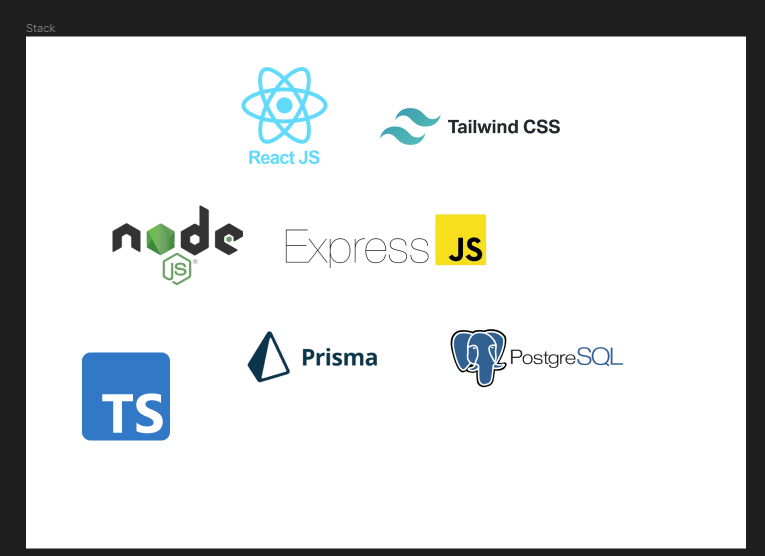

<h1 align="center"> Site de Avaliação de categorias - Projeto sob demanda </h1>
<h2 align='center'>Em Desenvolvimento</h2>

Projeto profissional sob demanda, consiste em ser um site de avaliação de categorias de um E-Commerce.

  <a href="#-tecnologias">Tecnologias</a>&nbsp;&nbsp;&nbsp;|&nbsp;&nbsp;&nbsp;
  <a href="#-projeto">Projeto</a>&nbsp;&nbsp;&nbsp;|&nbsp;&nbsp;&nbsp;
  <a href="#-imagens">Imagens</a>&nbsp;&nbsp;&nbsp;|&nbsp;&nbsp;&nbsp;
  <a href="#memo-licença">Licença</a>&nbsp;&nbsp;&nbsp;|&nbsp;&nbsp;&nbsp;
  <a href="#-autor">Contato</a>

  

 

## 🚀 Tecnologias

Esse projeto está sendo desenvolvido com as seguintes tecnologias:

- Frontend:
    - HTML
    - CSS
    - JavaScript
    - TypeScript
    - ReactJs
    - NextJs
    - TailwindCSS

- Backend:
    - NodeJs
    - Fastify
    - Prisma

- Banco de Dados:
    - Postgres

## 💻 Projeto

O projeto é uma aplicação web responsiva que consiste em ser um site de avaliação de categorias de um E-commerce, 
após a compra, o cliente poderá avaliar três categorias: "Produtos", "Entrega" e "Atendimento" atribuindo estrelas de 1(um) a 5(cinco).

## Imagens

  

  

  

  

## :memo: Licença

Esse projeto está sob a licença MIT.

## 🙋🏻 Autor

<a href="https://www.linkedin.com/in/brenohsilva/" target="_blank">BRENO SILVA</a>

## :earth_americas: &nbsp;<i>Onde me encontrar:</i>

  
 
 
